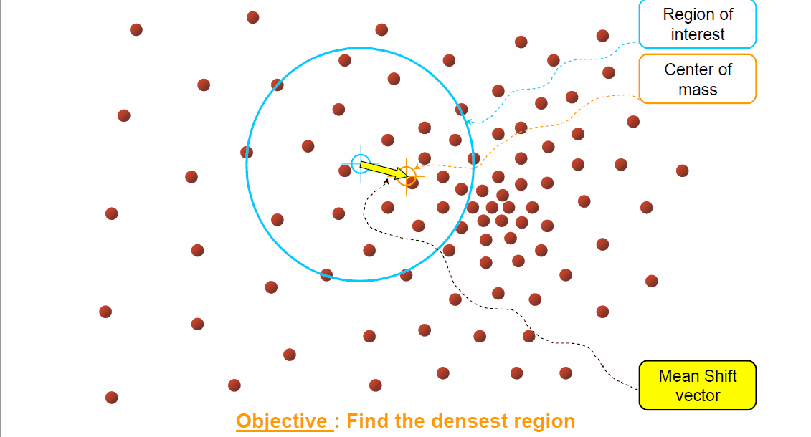

# mean_shift_video_track
Using MeanShift to track target in video

## Introduction 

`Mean Shift` is a well known non-parametric feature-space analysis technique for locating the maxima of a density function. It can be used in cluster analysising in computer vision and image processing.

To get to know the basic procedure for target tracking in video, you can read this [document](http://www.cse.psu.edu/~rtc12/CSE598C/meanshiftIntro.pdf). The original paper for object tracking in video is [Real-Time Tracking of Non-Rigid Objects using Mean Shift](https://ieeexplore.ieee.org/document/854761).

The basic procedure of Mean Shift of finding the most density location in a cluster is demonstrate as bellow:

## Environment Requirements

* gcc: at least support standard 11
* OpenCV 3.x

## Result

The GIF below display an example for tracking object in video. At the beginning, a target should be selected, and the histgrame of the target will be calculated. Then, at each comming frame, new position will be calculated based on Bhattacharyya coefficient and the position update formula.

This project may be slow, since the demo's input video size is big, thus is slow when running. And some special cases, such as the target  is occluded for a period of time, some very likely area nearby may distract the algorithm and lost the target. Some better policies may be needed for solving this cases.

